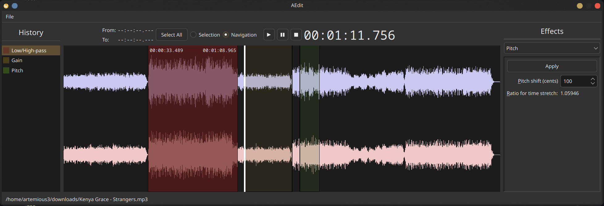

# AEdit - a simple audio editor

This project was made in order to gain first experience in audio programming. 
It utilizes some of key audio processing algorithms, most of which are based 
on Fast Fourier Transform. It containts following audio effects:

- Gain 

- Pitch (fixed time) 

- Pitch (no fixed time)

- Reverb 

- Robotiser 

- Low/High-pass 

## Build

Note that the project should be cloned as follows

``git clone --recursive https://github.com/artemious3/aedit/``

Then from the root directory of repo run 

``mkdir build && cd build && cmake .. && cmake --build .``

In the build directory you'll find executable ``aedit``.
